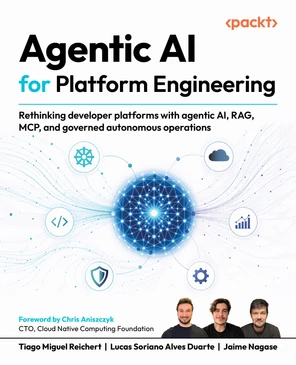

# [Book] Agentic AI for Platform Engineering [ENG, 2026]




**Original src:**  
https://github.com/PacktPublishing/Agentic-AI-for-Platform-Engineering

Companion code for the book *AI-Driven Platform Engineering*. Every chapter's labs run locally on **one shared kind cluster** you create once, on your own machine — no cloud account required (Amazon EKS works too if you prefer).


## Start here

```bash
cd 00-cluster-setup
./setup-cluster.sh   # kind cluster 'agentic-platform' + Metrics Server + ArgoCD
./verify.sh          # sanity-check the environment
```

See [`00-cluster-setup/README.md`](./00-cluster-setup/README.md) for details, EKS notes, and teardown.

## Layout

| Path | Chapter | What it builds |
|---|---|---|
| [`00-cluster-setup/`](./00-cluster-setup/) | — | The shared local cluster every chapter runs on (kind + Metrics Server + ArgoCD) |
| [`chapter-04/`](./chapter-04/) | 4 — Driving Platform Intelligence with Organizational Knowledge | A local RAG pipeline (Postgres + pgvector) and an MCP server over platform knowledge — RAG vs MCP, hands-on |
| [`chapter-05/`](./chapter-05/) | 5 — Building an AI-Powered Backstage Platform | Backstage + GitOps (ArgoCD), an AI chat assistant, catalog awareness, and Kubernetes actions |
| [`chapter-07/`](./chapter-07/) | 7 — Operational Agents in Production | A production-grade agent that proposes changes through the same GitOps flow |
| [`chapter-08/`](./chapter-08/) | 8 — Security in Practice | OPA policy enforcement, signed identity propagation, tenant isolation, and security evidence |
| [`chapter-09/`](./chapter-09/) | 9 — Future Directions | A **living memory graph**: an MCP server over a curated, PR-extensible knowledge graph seeded with the whole book — connect a local agent and extend it over time |

## Conventions across chapters

- **Cluster:** the single kind cluster from `00-cluster-setup` (offline, reproducible).
- **LLM provider:** Amazon Bedrock with Claude by default; Anthropic API direct documented as a fallback for readers without AWS access.
- **Deploy channel (Ch. 5 and 7):** GitOps only — PR → merge → ArgoCD. You don't `kubectl apply` application workloads by hand.
